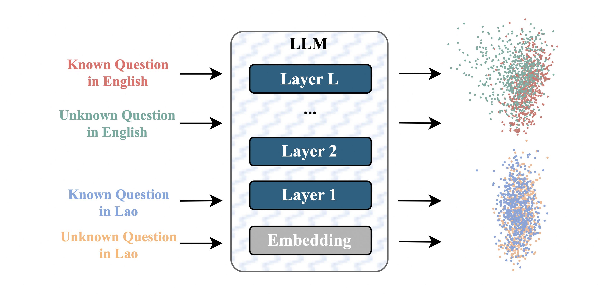

<div align="center">

<h1>Analyzing LLMs' Knowledge Boundary Cognition Across Languages Through the Lens of Internal Representations</h1>

<div>
    <a target='_blank'>Chenghao Xiao<sup>1,2</sup>,</a>&emsp;
    <a target='_blank'>Hou Pong Chan<sup>1,#</sup>,</a>&emsp;
    <a target='_blank'>Hao Zhang<sup>1,#</sup>,</a>&emsp;
    <a target='_blank'>Mahani Aljunied<sup>1</sup>,</a>&emsp;
    <a target='_blank'>Lidong Bing<sup>1</sup></a>&emsp;
    <a target='_blank'>Noura Al Moubayed<sup>2</sup></a>&emsp;
    <a target='_blank'>Yu Rong<sup>1</sup></a>&emsp;
</div>

<div>
    <em><sup>1</sup>DAMO Academy, Alibaba Group, <sup>2</sup>Durham University</em>&emsp;
    <em><sup>#</sup>Corresponding Authors</em>
</div>

<div align="center">
  <a href="https://arxiv.org/pdf/2504.13816">
    
  </a>
  <a href="https://huggingface.co/collections/SeaLLMs/evaluation-suite-for-hallucination-of-multilingual-llms-6842674a542c9011f1bfbefb">
    
  </a>
</div>


---

</div>


#### 🌟This repo contains the code and datasets for the paper "Analyzing LLMs' Knowledge Boundary Cognition Across Languages Through the Lens of Internal Representations" to appear at ACL 2025.

## 🎉 Updates
- **[2025-05]** Our paper is accepted by ACL 2025.
- **[2025-04]** Check out our [paper](https://arxiv.org/pdf/2504.13816) on arxiv.

## Overview
We present the first study to analyze how LLMs recognize knowledge boundaries across different languages by probing their internal representations when processing known and unknown questions in multiple languages. 

Our empirical studies reveal three key findings: 1) LLMs' perceptions of knowledge boundaries are encoded in the middle to middle-upper layers across different languages. 2) Language differences in knowledge boundary perception follow a linear structure, which motivates our proposal of a training-free alignment method that effectively transfers knowledge boundary perception ability across languages, thereby helping reduce hallucination risk in low-resource languages; 3) Fine-tuning on bilingual question pair translation further enhances LLMs' recognition of knowledge boundaries across languages. 

Given the absence of standard testbeds for cross-lingual knowledge boundary analysis, we construct a multilingual evaluation suite comprising three representative types of knowledge boundary data.

<div align='left'></div>

<!--We are updating all code and resources.-->

## Evaluation Suite
Links to our datasets:
[FreshQA-multilingual](https://huggingface.co/datasets/SeaLLMs/FreshQA-multilingual); [FreshQA-multilingual-augmented](https://huggingface.co/datasets/SeaLLMs/FreshQA-multilingual-augmented); [True-False-multilingual](https://huggingface.co/datasets/SeaLLMs/TrueFalse-Statements-multilingual); [SeaRefuse](https://huggingface.co/datasets/SeaLLMs/SeaRefuse-test)

## Inference Code
Code for linear probe, and using mean-shifting \& linear projection to align language subspaces.
```
python inference.py \
    --model_name Qwen/Qwen2.5-7B \
    --dataset_name SeaLLMs/FreshQA-multilingual \
    --output_path "./transferability_results/7B/Qwen_base_7B.json" \
    --methods "identical" "mean shifting" "linear projection" \
    --use_template True \
    --batch_size 50
```

## Citation
```
@inproceedings{xiao2025analyzingllmsknowledgeboundary,
      title={Analyzing LLMs' Knowledge Boundary Cognition Across Languages Through the Lens of Internal Representations}, 
      author={Chenghao Xiao and Hou Pong Chan and Hao Zhang and Mahani Aljunied and Lidong Bing and Noura Al Moubayed and Yu Rong},
    booktitle = "Proceedings of the Annual Meeting of the Association for Computational Linguistics ({ACL})",
    month = {July},
    year = "2025",
    url={https://arxiv.org/abs/2504.13816}, 
    publisher = "Association for Computational Linguistics",
}
```
